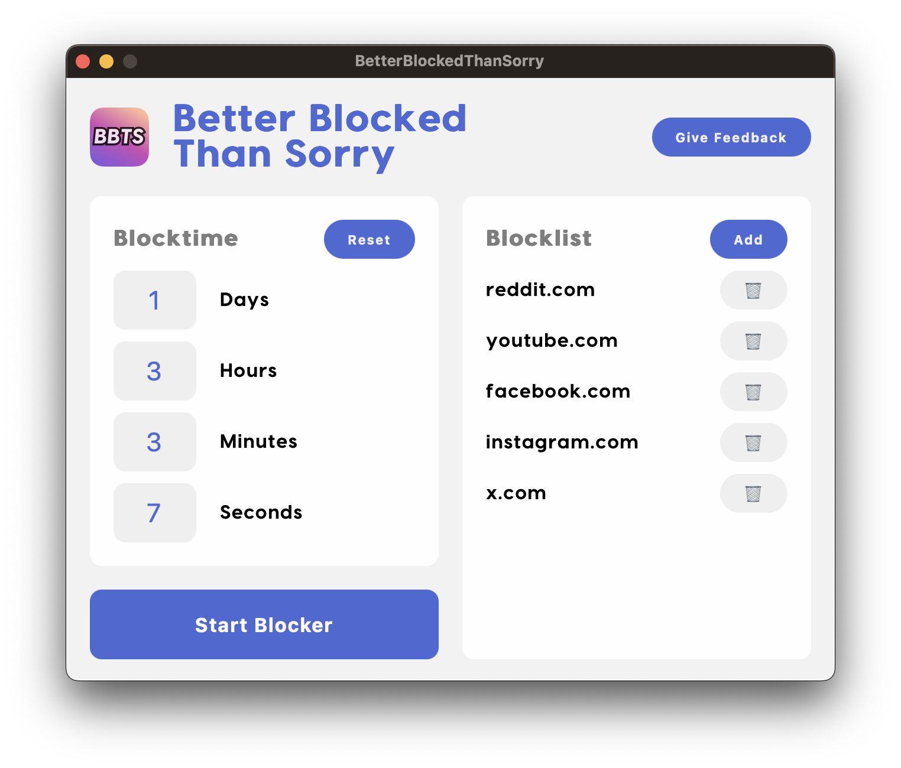

# betterBlockedThanSorry

Block access to websites for a certain time period.

<!-- <p align="center">
  
</p> -->



## How it works

Add websites you want to block to the block list, set a duration for which the websites will be blocked, and then press "Start Blocker!".

## How to run

> **_NOTE:_** This only works for MacOS at the moment. Adding support for Windows is easy, but I'm lazy.

Start by installing [go](https://go.dev/) and [wails](https://wails.io/).

### Dev

Run:

```sh
# main (gui)
./run.sh

# daemon
go run cmd/daemon/main.go
```

#### How to run tests

Run:

```sh
# run all tests
go test ./...
```

### Prod

#### Build

```sh
# build for MacOS
./build/build_macos.sh
```
